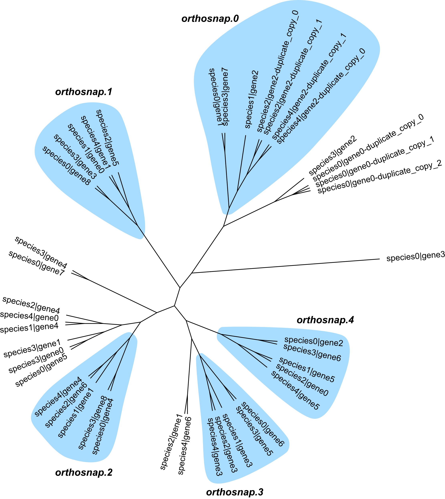

Tutorial
========

**orthosnap** enables researchers to obtain single-copy subgroups of
orthologous genes. Single-copy subgroups of orthologous genes are
phylogenetically-informative and can be used for molecular evolution
analyses. This tutorial covers the easy-to-implement workflow needed
for using orthofisher.

Note, this tutorial assumes orthosnap has already been installed. For
installation instructions, please see the home page.

^^^^^

1) Download the test data
#########################

For ease of use, this tutorial will rely on a small dataset, which can be
downloaded using the following link:

.. centered::
   Download test data:
   :download:`tutorial dataset </data/dataset.tar.gz>`

Next, unzip the downloaded directory and change directory to the newly downloaded directory.

.. code-block:: shell

   $ tar -zxvf dataset.tar.gz
   $ cd path_to_unzipped_directory/dataset

|

2) Run orthosnap
################

Running orthosnap requires two arguments: -f/\-\-fasta, which specifies the unaligned orthologous
group of sequences, and -t/\-\-tree, which species the phylogeny inferred from the orthologous
group of sequences. Thus, orthosnap would be run using the following command:

.. code-block:: shell

   $ orthosnap -f fake_orthologous_group_of_genes.faa -t fake_orthologous_group_of_genes_tree.tre

|

3) Inspect output
#################

Toward the end of what is printed to the stdout, you will see the following text:

.. code-block:: shell

   Subgroups of single-copy orthologous genes identified: 5
   Output files:
      fake_orthologous_group_of_genes.faa.orthosnap.0.fa
      fake_orthologous_group_of_genes.faa.orthosnap.1.fa
      fake_orthologous_group_of_genes.faa.orthosnap.2.fa
      fake_orthologous_group_of_genes.faa.orthosnap.3.fa
      fake_orthologous_group_of_genes.faa.orthosnap.4.fa

This means that five single-copy orthologous subgroups of genes were identified. Each
subgroup was written to a different file titled fake_orthologous_group_of_genes.faa.orthosnap.\ *N*\ .fa.
Each subgroup can be used for various molecular evolution analyses (e.g., phylogenetics, dN/dS, etc.)

|

To provide a little more detail about what orthosnap did, the following figure visualizes each subgroup
in the original inputted phylogeny.

In *orthosnap.0*, species 2 and species 4 have duplicate copies of gene 2. After automated detection of
duplicate sister sequences (or sequences that belong to the same polytomy), orthosnap will keep the longer
of the two sequences following PhyloTreePruner. This follows the standard for transcriptomic data wherein
the longest isoform is often kept. Reevaluation of the pruned subtree results in the inference of a 
single-copy subgroup of orthologous genes.

Although the species names and gene names have been replaced, the underlying data stems from real 
sequences of protein transporters in five *Aspergillus* species. Similar to the species tree,
*species4* and *species2* are sister to one another; *species4* and *species2* are sister to 
*species1*; and *species4*, *species2* and *species2* are sister to *species3* and *species0*. This
follows our observation described in the original manuscript wherein subgroups of single-copy
orthologous genes are often as accurate and robust inferred as 'traditional' single-copy orthologous genes.

Thank you for checking out orthosnap!

|

