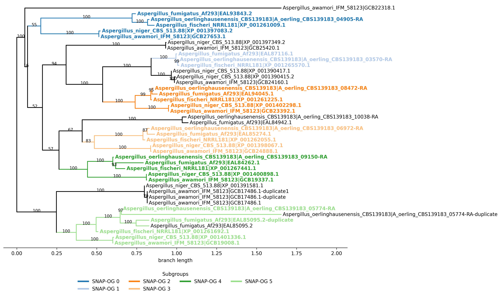

Usage
=====

This section covers practical OrthoSNAP usage. For a full worked example, see the tutorial.

OrthoSNAP takes:

- a gene tree in Newick format
- the FASTA file used to infer that tree

It outputs one FASTA file per inferred SNAP-OG (single-copy orthologous subgroup). Optionally, it can also write a Newick tree per SNAP-OG, an inparalog handling report, and one color-coded subgroup plot for the full input tree.

Version differences
-------------------

**v1.6.0** expands OrthoSNAP from single-run CLI usage to pipeline-oriented workflows:

- Batch manifests (``--manifest``)
- Validation-only preflight checks (``--validate-only``)
- Structured provenance output (``--structured-output``)
- Explicit occupancy semantics (``--occupancy-count``, ``--occupancy-fraction``)
- Resume-aware execution (``--resume``)
- Bootstrap consensus subgrouping (``--bootstrap-trees``, ``--consensus-min-frequency``, ``--consensus-trees``)

Compared with prior versions:

- **v1.5.0**: plotting outputs and performance improvements.
- **v1.3.2**: delimiter configurability.
- **v1.2.0**: inparalog handling report output.
- **v1.0.0 and earlier**: core subgroup extraction/pruning behavior.

Basic usage
-----------

For most cases, only `-f/--fasta` and `-t/--tree` are required:

.. code-block:: shell

   $ orthosnap -f orthogroup_of_genes.faa -t phylogeny_of_orthogroup_of_genes.tre

Validation-only preflight
-------------------------

Use ``--validate-only`` to check tree/FASTA concordance, delimiter consistency,
and duplicate labels without performing SNAP-OG extraction.

.. code-block:: shell

   $ orthosnap -f orthogroup_of_genes.faa -t phylogeny_of_orthogroup_of_genes.tre --validate-only

Structured provenance outputs
-----------------------------

Use ``--structured-output`` to emit machine-readable run metadata and subgroup summaries.

Generated files:

- ``<input>.orthosnap.run.json`` (inputs, hashes, arguments, timing, status)
- ``<input>.orthosnap.subgroups.tsv`` (subgroup-level summary)

.. code-block:: shell

   $ orthosnap -f orthogroup_of_genes.faa -t phylogeny_of_orthogroup_of_genes.tre --structured-output

Occupancy modes
---------------

OrthoSNAP supports three occupancy inputs:

- ``-o/--occupancy`` legacy numeric threshold
- ``--occupancy-count`` explicit count threshold
- ``--occupancy-fraction`` fraction in ``(0, 1]`` converted to a count per input FASTA

Use only one occupancy mode at a time.

.. code-block:: shell

   $ orthosnap -f orthogroup_of_genes.faa -t phylogeny_of_orthogroup_of_genes.tre --occupancy-count 5

.. code-block:: shell

   $ orthosnap -f orthogroup_of_genes.faa -t phylogeny_of_orthogroup_of_genes.tre --occupancy-fraction 0.5

Resume mode
-----------

Use ``--resume`` to skip rerunning jobs that already have completed outputs in the target directory.

.. code-block:: shell

   $ orthosnap -f orthogroup_of_genes.faa -t phylogeny_of_orthogroup_of_genes.tre --resume

Batch manifest mode
-------------------

Use ``--manifest`` with a TSV/CSV listing runs. Required columns are:

- ``tree``
- ``fasta``

Optional per-row columns can override CLI defaults (for example: ``support``, ``occupancy``,
``occupancy_count``, ``occupancy_fraction``, ``delimiter``, ``rooted``, ``snap_trees``,
``report_inparalog_handling``, ``inparalog_to_keep``, ``output_path``, ``id``).

.. code-block:: shell

   $ orthosnap --manifest runs.tsv --structured-output -op batch_results/

Manifest mode writes aggregate summaries:

- ``manifest_summary_<timestamp>.tsv``
- ``manifest_summary_<timestamp>.json``

Bootstrap consensus mode
------------------------

Use ``--bootstrap-trees`` with a plain-text file containing one tree path per line.
OrthoSNAP extracts subgroup tip sets from each tree and reports consensus groups.

Use ``--consensus-min-frequency`` to require a minimum support frequency.
Use ``--consensus-trees`` to additionally write one consensus Newick tree per emitted group.

.. code-block:: shell

   $ orthosnap -f orthogroup_of_genes.faa -t reference.treefile --bootstrap-trees bootstrap_paths.txt --consensus-min-frequency 0.5

.. code-block:: shell

   $ orthosnap -f orthogroup_of_genes.faa -t reference.treefile --bootstrap-trees bootstrap_paths.txt --consensus-trees

Input requirements
------------------

- FASTA headers and tree tip labels must match.
- Taxon and sequence IDs must be separated by the same delimiter in both files.
- Default delimiter is `|` (for example, `species_A|gene_001`).

Accounting for tree uncertainty
-------------------------------

OrthoSNAP can collapse low-support bipartitions before pruning inparalogs.

- Default support threshold is `80`.
- Use `-s/--support` to change it.

.. code-block:: shell

   $ orthosnap -f orthogroup_of_genes.faa -t phylogeny_of_orthogroup_of_genes.tre -s 70

Choosing which inparalog to keep
--------------------------------

Use `-ip/--inparalog_to_keep` to select how species-specific inparalogs are resolved.

Supported values:

- `shortest_seq_len`
- `median_seq_len`
- `longest_seq_len` (default)
- `shortest_branch_len`
- `median_branch_len`
- `longest_branch_len`

Examples:

.. code-block:: shell

   $ orthosnap -f orthogroup_of_genes.faa -t phylogeny_of_orthogroup_of_genes.tre -ip shortest_branch_len

.. code-block:: shell

   $ orthosnap -f orthogroup_of_genes.faa -t phylogeny_of_orthogroup_of_genes.tre -ip median_seq_len

Inparalog handling report
-------------------------

Use `-rih/--report_inparalog_handling` to write a tab-delimited report named
`<input_fasta>.inparalog_report.txt`.

Columns are:

- SNAP-OG identifier
- kept inparalog
- trimmed inparalog(s), separated by `;`

.. code-block:: shell

   $ orthosnap -f orthogroup_of_genes.faa -t phylogeny_of_orthogroup_of_genes.tre -rih

Specifying the delimiter
------------------------

If your headers do not use `|`, specify the delimiter with `-d/--delimiter`.

.. code-block:: shell

   $ orthosnap -f orthogroup_of_genes.faa -t phylogeny_of_orthogroup_of_genes.tre -d -

Plotting SNAP-OG assignments
----------------------------

Use `-ps/--plot_snap_ogs` to create one figure of the full tree with distinct colors for each inferred SNAP-OG.
Default plot format is PNG; choose PDF or SVG with `-pf/--plot_format`.

.. code-block:: shell

   $ orthosnap -f orthogroup_of_genes.faa -t phylogeny_of_orthogroup_of_genes.tre -ps

.. code-block:: shell

   $ orthosnap -f orthogroup_of_genes.faa -t phylogeny_of_orthogroup_of_genes.tre -ps -pf svg

Example output (`png`):

Performance Benchmark
---------------------

The chart below summarizes benchmarked runtime across selected PyPI releases and the current local version.
Runs used a rooted input tree (`-r`), one warm-up run per version, and three measured runs per version on the same dataset.

Compared versions:

- `1.1.0` (PyPI baseline)
- `1.2.0` (PyPI)
- `1.3.2` (PyPI)
- `1.6.0-current` (local)

.. image:: ../_static/img/orthosnap_speedup_pypi_comparison.png
   :width: 100%
   :align: center
   :alt: Runtime and speedup comparison for OrthoSNAP versions from PyPI baseline to current local version.

All options
-----------

.. list-table::
   :header-rows: 1
   :widths: 28 72

   * - Option
     - Meaning
   * - ``-h/--help``
     - Print help message.
   * - ``-v/--version``
     - Print software version.
   * - ``-f/--fasta``
     - Input FASTA file.
   * - ``-t/--tree``
     - Input tree file in Newick format.
   * - ``-s/--support``
     - Collapse threshold for branch support (default: 80).
   * - ``-o/--occupancy``
     - Minimum represented taxa for subgroup candidates (default: rounded half of taxa in input FASTA).
   * - ``--occupancy-count``
     - Explicit minimum represented-taxa count.
   * - ``--occupancy-fraction``
     - Minimum represented-taxa fraction in ``(0, 1]``; converted to count for each input FASTA.
   * - ``-r/--rooted``
     - Treat input tree as rooted; otherwise midpoint-root it (default: false).
   * - ``-d/--delimiter``
     - Delimiter between taxon and sequence IDs (default: ``|``).
   * - ``-st/--snap_trees``
     - Also write SNAP-OG trees in Newick format (default: false).
   * - ``-ip/--inparalog_to_keep``
     - Rule for keeping one inparalog among species-specific duplicates (default: ``longest_seq_len``).
   * - ``-rih/--report_inparalog_handling``
     - Write tab-delimited inparalog handling report (default: false).
   * - ``-op/--output_path``
     - Output directory (default: directory containing input FASTA).
   * - ``--manifest``
     - Batch mode: run many jobs from a TSV/CSV manifest.
   * - ``--validate-only``
     - Validate inputs and exit without running extraction.
   * - ``--resume``
     - Skip runs that already have completed outputs.
   * - ``--structured-output``
     - Write JSON/TSV provenance and subgroup summaries.
   * - ``--bootstrap-trees``
     - File with bootstrap tree paths (one per line) for consensus subgrouping.
   * - ``--consensus-min-frequency``
     - Minimum subgroup frequency required to emit a consensus group (default: 0.5).
   * - ``--consensus-trees``
     - In consensus mode, also write one Newick tree per emitted consensus group.
   * - ``-ps/--plot_snap_ogs``
     - Write one color-coded full-tree plot with subgroup labels (default: false).
   * - ``-pf/--plot_format``
     - Output format for subgroup plot (``png`` default, or ``pdf``/``svg``).

For genome-scale analyses, consider using the same `-o/--occupancy` value across all gene families to keep SNAP-OG occupancy thresholds consistent.
